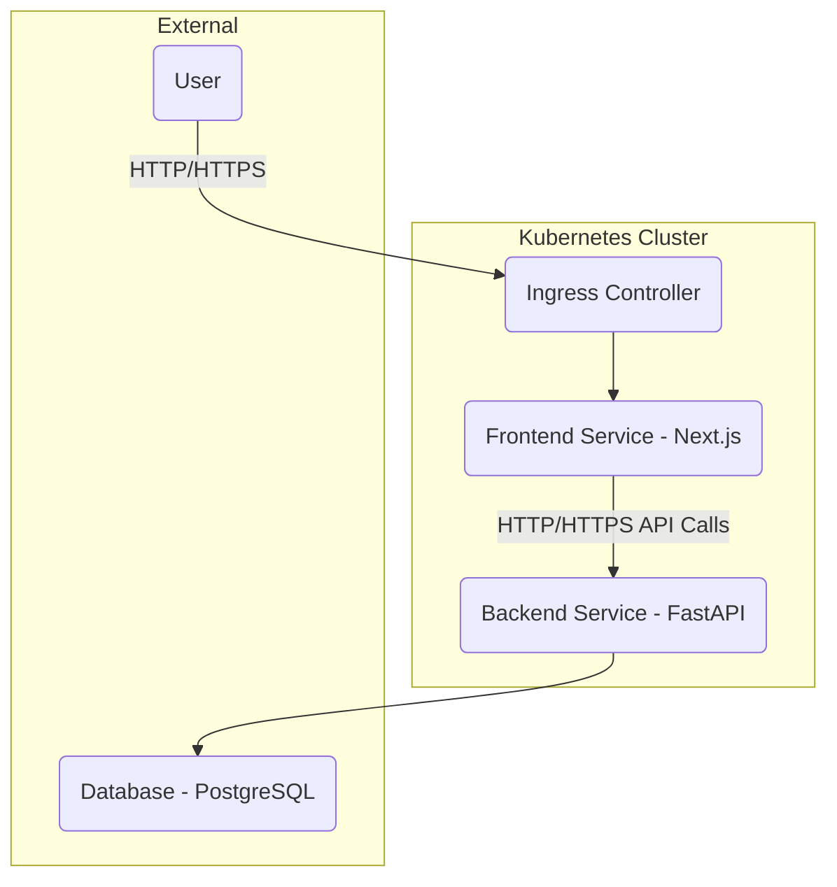

# Architecture Diagrams

This document provides a high-level overview of the Todo application's architecture, particularly focusing on its deployment within a Kubernetes cluster.

## 1. High-Level System Architecture



### Components:

*   **User**: Interacts with the application via a web browser.
*   **Ingress Controller**: Manages external access to the services in the cluster, typically handling routing and SSL termination.
*   **Frontend Service (Next.js)**: The user-facing web application. Runs as a containerized application within Kubernetes.
*   **Backend Service (FastAPI)**: The API server that handles business logic and data persistence. Runs as a containerized application within Kubernetes.
*   **Database (PostgreSQL)**: The primary data store for the application. In the current setup, this is an external Neon Serverless PostgreSQL instance, but could also be deployed within the cluster as a StatefulSet.

## 2. Kubernetes Deployment Overview

```mermaid
graph TD
    subgraph User Interaction
        Browser(Web Browser)
    end

    subgraph External Network
        Browser -- Requests --> Internet(Internet)
    end

    subgraph Minikube Cluster
        svc_ingress[Kubernetes Ingress Service]
        svc_frontend[Frontend Service<br/>(ClusterIP)]
        svc_backend[Backend Service<br/>(ClusterIP)]
        dep_frontend[Frontend Deployment<br/>(Next.js App)]
        dep_backend[Backend Deployment<br/>(FastAPI App)]
        pod_frontend_repl1(Frontend Pod 1)
        pod_frontend_repl2(Frontend Pod 2)
        pod_backend_repl1(Backend Pod 1)
        pod_backend_repl2(Backend Pod 2)
    end

    subgraph External Database
        db_neon[Neon Serverless PostgreSQL]
    end

    Browser -- Public IP/Domain --> Internet
    Internet -- HTTP/HTTPS --> svc_ingress

    svc_ingress -- Routes --> svc_frontend
    svc_frontend -- Traffic --> dep_frontend
    dep_frontend -- Manages --> pod_frontend_repl1
    dep_frontend -- Manages --> pod_frontend_repl2

    pod_frontend_repl1 -- API Calls --> svc_backend
    pod_frontend_repl2 -- API Calls --> svc_backend

    svc_backend -- Traffic --> dep_backend
    dep_backend -- Manages --> pod_backend_repl1
    dep_backend -- Manages --> pod_backend_repl2

    pod_backend_repl1 -- DB Connection --> db_neon
    pod_backend_repl2 -- DB Connection --> db_neon
```

### Flow Explanation:

1.  **User Access**: Users access the application via their web browser through a public IP or domain name routed through the internet.
2.  **Ingress**: Requests hit the Kubernetes Ingress Service, which routes traffic to the appropriate internal service based on rules (e.g., hostnames, paths).
3.  **Frontend Service**: The Ingress routes traffic to the `Frontend Service` (ClusterIP), which load-balances requests across `Frontend Deployment` replicas.
4.  **Frontend Deployment**: Manages multiple pods running the Next.js frontend application.
5.  **Backend API Calls**: Frontend pods make API calls to the `Backend Service` (ClusterIP) for data and business logic.
6.  **Backend Service**: Load-balances API requests across `Backend Deployment` replicas.
7.  **Backend Deployment**: Manages multiple pods running the FastAPI backend application.
8.  **Database Access**: Backend pods connect to the external Neon Serverless PostgreSQL database to persist and retrieve data.

### Key Kubernetes Resources:

*   **Deployments**: Manage the desired state for stateless applications (Frontend, Backend).
*   **Services (ClusterIP)**: Provide internal, stable endpoints for communication between pods (Frontend, Backend).
*   **Service (Ingress)**: Manages external access to services, typically used for HTTP/HTTPS routing.
*   **Pods**: The smallest deployable units in Kubernetes, running the application containers.
*   **ExternalName Service**: (Implicitly used) for connecting to external services like Neon DB without proxying.

## 3. Data Flow

*   **User Input**: Data from the user (e.g., creating a task) is sent to the Frontend.
*   **Frontend Processing**: Frontend sends validated data to the Backend API.
*   **Backend Processing**: Backend validates data, processes business logic, and stores/retrieves it from the PostgreSQL Database.
*   **Database**: Persists application state.
*   **Backend Response**: Backend sends processed data back to the Frontend.
*   **Frontend Display**: Frontend renders the updated state to the user.
