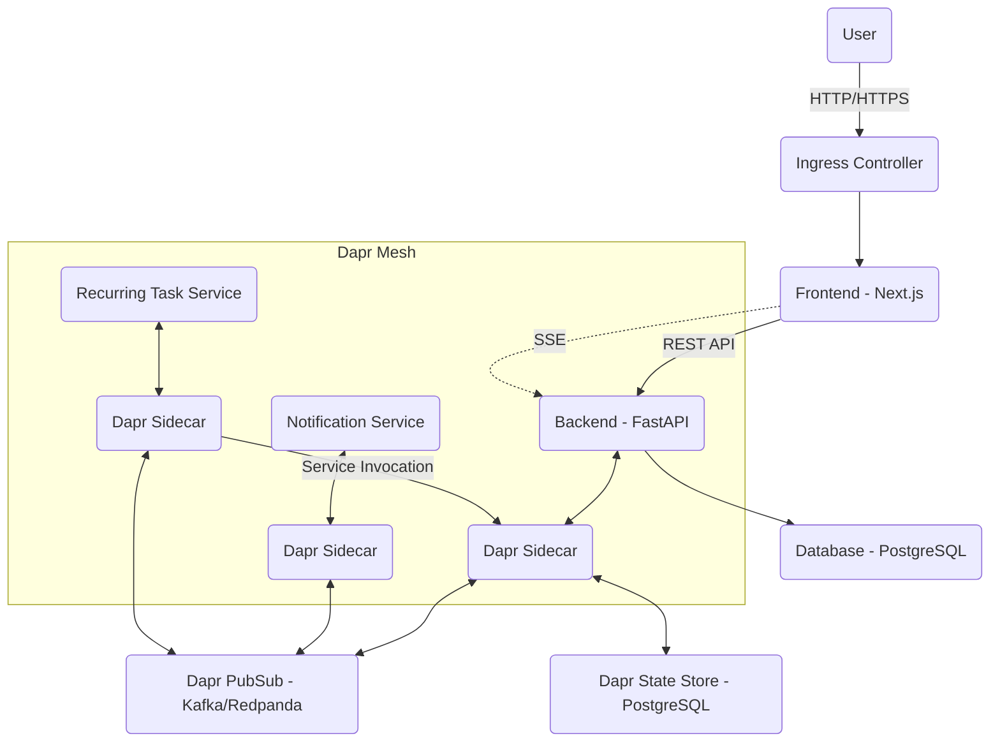
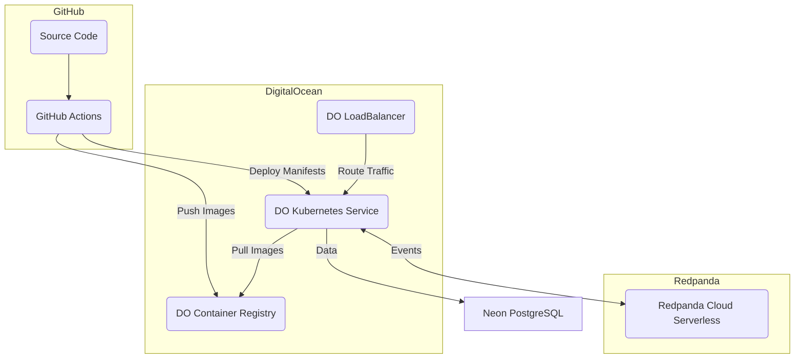

# Architecture Diagrams

This document provides a high-level overview of the Todo application's architecture, particularly focusing on its deployment within a Kubernetes cluster.

## 1. High-Level System Architecture (Event-Driven)

```mermaid
graph TD
    User(User) --> |HTTP/HTTPS| IngressController(Ingress Controller);
    IngressController --> Frontend(Frontend - Next.js);
    Frontend --> |REST API| Backend(Backend - FastAPI);
    Frontend -.-> |SSE| Backend;
    
    subgraph Dapr Mesh
        Backend <--> DB_S(Dapr Sidecar);
        NotifService(Notification Service) <--> DN_S(Dapr Sidecar);
        RecurService(Recurring Task Service) <--> DR_S(Dapr Sidecar);
    end
    
    DB_S <--> PubSub(Dapr PubSub - Kafka/Redpanda);
    DN_S <--> PubSub;
    DR_S <--> PubSub;
    
    DB_S <--> StateStore(Dapr State Store - PostgreSQL);
    
    DR_S --> |Service Invocation| DB_S;
    
    Backend --> Database(Database - PostgreSQL);
```

### Components:

*   **User**: Interacts with the application via a web browser.
*   **Frontend (Next.js)**: The user-facing web application. Communicates with Backend via REST and listens for real-time updates via Server-Sent Events (SSE).
*   **Backend (FastAPI)**: The core API server. Publishes events to Dapr Pub/Sub and manages the primary task database.
*   **Notification Service**: A dedicated microservice that listens for `reminder.triggered` events and processes notifications.
*   **Recurring Task Service**: A dedicated microservice that listens for `task.completed` events and calculates/creates the next occurrence of recurring tasks.
*   **Dapr Sidecars**: Manage cross-cutting concerns like Pub/Sub, Service Invocation, State Management, and Job Scheduling.
*   **Kafka (Redpanda)**: The underlying message broker for Dapr Pub/Sub.
*   **Database (PostgreSQL)**: The primary data store for the application.

## 2. Event-Driven Communication Flows

### Task Completion & Recurrence
1.  **User** marks task as completed in **Frontend**.
2.  **Backend** updates task status in **Database** and publishes `task.completed` event via **Dapr Sidecar**.
3.  **Dapr** routes `task.completed` event to **Recurring Task Service**.
4.  **Recurring Task Service** calculates next occurrence and calls **Backend** via **Dapr Service Invocation** to create the new task.
5.  **Backend** creates the task and publishes `task.created` event.
6.  **Backend** (via SSE) pushes `task.created` notification to the **Frontend** for real-time UI update.

### Scheduled Reminders
1.  **User** sets a reminder in **Frontend**.
2.  **Backend** schedules a job via **Dapr Jobs API**.
3.  At the scheduled time, **Dapr** triggers the **Backend** callback.
4.  **Backend** publishes `reminder.triggered` event.
5.  **Notification Service** receives the event and logs/sends the alert.

## 3. Kubernetes Deployment Overview

```mermaid
graph TD
    subgraph User Interaction
        Browser(Web Browser)
    end

    subgraph External Network
        Browser -- Requests --> Internet(Internet)
    end

    subgraph Minikube Cluster
        svc_ingress[Kubernetes Ingress Service]
        svc_frontend[Frontend Service<br/>(ClusterIP)]
        svc_backend[Backend Service<br/>(ClusterIP)]
        dep_frontend[Frontend Deployment<br/>(Next.js App)]
        dep_backend[Backend Deployment<br/>(FastAPI App)]
        pod_frontend_repl1(Frontend Pod 1)
        pod_frontend_repl2(Frontend Pod 2)
        pod_backend_repl1(Backend Pod 1)
        pod_backend_repl2(Backend Pod 2)
    end

    subgraph External Database
        db_neon[Neon Serverless PostgreSQL]
    end

    Browser -- Public IP/Domain --> Internet
    Internet -- HTTP/HTTPS --> svc_ingress

    svc_ingress -- Routes --> svc_frontend
    svc_frontend -- Traffic --> dep_frontend
    dep_frontend -- Manages --> pod_frontend_repl1
    dep_frontend -- Manages --> pod_frontend_repl2

    pod_frontend_repl1 -- API Calls --> svc_backend
    pod_frontend_repl2 -- API Calls --> svc_backend

    svc_backend -- Traffic --> dep_backend
    dep_backend -- Manages --> pod_backend_repl1
    dep_backend -- Manages --> pod_backend_repl2

    pod_backend_repl1 -- DB Connection --> db_neon
    pod_backend_repl2 -- DB Connection --> db_neon
```

### Flow Explanation:

1.  **User Access**: Users access the application via their web browser through a public IP or domain name routed through the internet.
2.  **Ingress**: Requests hit the Kubernetes Ingress Service, which routes traffic to the appropriate internal service based on rules (e.g., hostnames, paths).
3.  **Frontend Service**: The Ingress routes traffic to the `Frontend Service` (ClusterIP), which load-balances requests across `Frontend Deployment` replicas.
4.  **Frontend Deployment**: Manages multiple pods running the Next.js frontend application.
5.  **Backend API Calls**: Frontend pods make API calls to the `Backend Service` (ClusterIP) for data and business logic.
6.  **Backend Service**: Load-balances API requests across `Backend Deployment` replicas.
7.  **Backend Deployment**: Manages multiple pods running the FastAPI backend application.
8.  **Database Access**: Backend pods connect to the external Neon Serverless PostgreSQL database to persist and retrieve data.

### Key Kubernetes Resources:

*   **Deployments**: Manage the desired state for stateless applications (Frontend, Backend).
*   **Services (ClusterIP)**: Provide internal, stable endpoints for communication between pods (Frontend, Backend).
*   **Service (Ingress)**: Manages external access to services, typically used for HTTP/HTTPS routing.
*   **Pods**: The smallest deployable units in Kubernetes, running the application containers.
*   **ExternalName Service**: (Implicitly used) for connecting to external services like Neon DB without proxying.

## 3. Data Flow

*   **User Input**: Data from the user (e.g., creating a task) is sent to the Frontend.
*   **Frontend Processing**: Frontend sends validated data to the Backend API.
*   **Backend Processing**: Backend validates data, processes business logic, and stores/retrieves it from the PostgreSQL Database.
*   **Database**: Persists application state.
*   **Backend Response**: Backend sends processed data back to the Frontend.
*   **Frontend Display**: Frontend renders the updated state to the user.

### Cloud Deployment (Phase V Part C)
The production deployment utilizes **DigitalOcean Kubernetes (DOKS)** for orchestration and **Redpanda Cloud** for managed event streaming.

#### Cloud Component Mapping:
- **Kubernetes**: Minikube (Dev) -> DOKS (Prod)
- **Kafka**: Local Redpanda (Dev) -> Redpanda Cloud Serverless (Prod)
- **Container Registry**: Local Docker -> DigitalOcean Container Registry
- **Database**: Neon Serverless PostgreSQL (Shared across Dev/Prod)
- **CI/CD**: Manual -> GitHub Actions

```mermaid
graph TD
    subgraph GitHub
        Code(Source Code) --> GHA(GitHub Actions);
    end
    
    subgraph DigitalOcean
        DOCR(DO Container Registry);
        DOKS(DO Kubernetes Service);
        LB(DO LoadBalancer);
    end
    
    subgraph Redpanda
        RPC(Redpanda Cloud Serverless);
    end

    GHA -->|Push Images| DOCR;
    GHA -->|Deploy Manifests| DOKS;
    DOKS -->|Pull Images| DOCR;
    LB -->|Route Traffic| DOKS;
    DOKS <-->|Events| RPC;
    DOKS -->|Data| db_neon[Neon PostgreSQL];
```

## 4. Advanced Features Data Model (Phase V)

The application uses a relational schema to support intelligent features:

- **Task**: Extended with `priority`, `due_date`, `recurrence_rule`, and `parent_task_id`.
- **Tag**: User-scoped labels for organizing tasks.
- **TaskTag**: Junction table for many-to-many relationship between tasks and tags.
- **Reminder**: Scheduled notification triggers linked to specific tasks.

### Recurrence Flow:
When a Task with a `recurrence_rule` is marked `completed`, the `handle_recurrence` service calculates the next `due_date` and initializes a new Task linked via `parent_task_id`.

